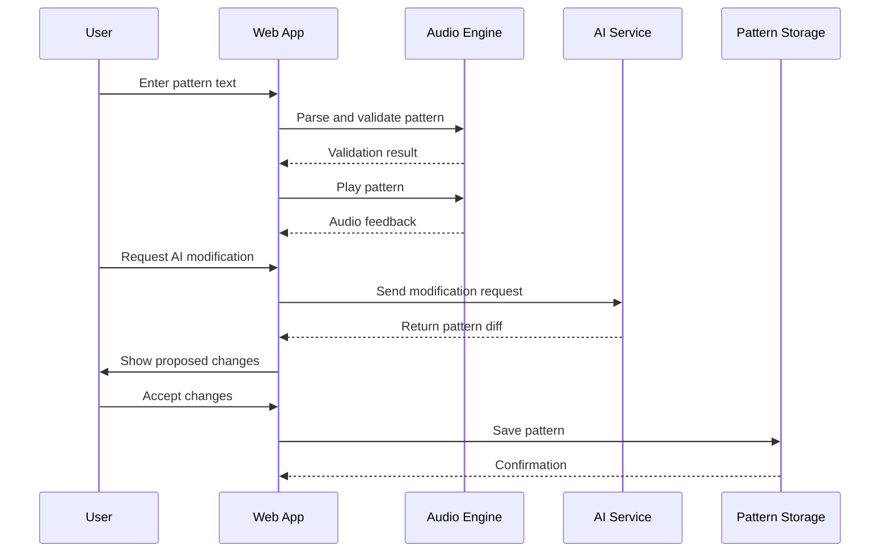

# ASCII Generative Sequencer (Web Edition) Fullstack Architecture Document

## Introduction

This document outlines the complete fullstack architecture for ASCII Generative Sequencer (Web Edition), including frontend implementation, backend systems, and their integration. It serves as the single source of truth for AI-driven development, ensuring consistency across the entire technology stack.

This unified approach combines what would traditionally be separate backend and frontend architecture documents, streamlining the development process for modern fullstack applications where these concerns are increasingly intertwined.

### Starter Template or Existing Project

**N/A - Greenfield project**

This is a completely new project with no existing codebase or starter templates. We'll build from scratch using modern web technologies optimized for browser-based audio processing and AI integration.

### Change Log

| Date | Version | Description | Author |
|------|---------|-------------|---------|
| 2024-01-15 | 1.0 | Initial architecture document creation | Architect |
| 2024-12-19 | 1.1 | Updated with current tech stack (pnpm, Vitest, current setup) | Dev Team |

## High Level Architecture

### Technical Summary

The ASCII Generative Sequencer is a browser-native, client-side application built with React and TypeScript, leveraging Web Audio API for real-time audio processing and OpenAI API for AI-assisted pattern generation. The architecture follows a Jamstack approach with static hosting and serverless functions for minimal backend requirements. The system uses Tone.js for audio synthesis, CodeMirror 6 for text editing, and Canvas 2D API for real-time visualizations, all running entirely in the browser for maximum accessibility and performance.

### Platform and Infrastructure Choice

**Platform:** Vercel + Supabase
**Key Services:** Vercel for static hosting and serverless functions, Supabase for user data and pattern storage
**Deployment Host and Regions:** Global CDN with edge functions for optimal performance

**Rationale:** Vercel provides excellent performance for static sites with global CDN, while Supabase offers a complete backend-as-a-service solution with real-time capabilities, authentication, and storage. This combination minimizes infrastructure complexity while providing enterprise-grade features.

### Repository Structure

**Structure:** Monorepo
**Monorepo Tool:** Turborepo
**Package Manager:** pnpm (workspace protocol)
**Package Organization:** Apps (web, api) and packages (shared, ui, config)

### High Level Architecture Diagram


### Architectural Patterns

- **Jamstack Architecture:** Static site generation with serverless APIs - _Rationale:_ Optimal performance and scalability for content-heavy applications
- **Component-Based UI:** Reusable React components with TypeScript - _Rationale:_ Maintainability and type safety across large codebases
- **Client-Side State Management:** React Context with useReducer - _Rationale:_ Simple state management for client-side application
- **Serverless Functions:** Vercel Edge Functions for API endpoints - _Rationale:_ Scalable, cost-effective backend processing
- **Real-Time Updates:** Supabase real-time subscriptions - _Rationale:_ Live collaboration and pattern sharing capabilities

## Tech Stack

| Category | Technology | Version | Purpose | Rationale |
|----------|------------|---------|---------|-----------|
| Frontend Language | TypeScript | 5.0+ | Type-safe development | Enhanced developer experience and fewer runtime errors |
| Frontend Framework | React | 18.0+ | UI framework | Mature ecosystem, excellent performance, great developer tools |
| UI Component Library | Custom Components | - | UI consistency | Tailored for audio/music interface needs |
| State Management | React Context + useReducer | - | Application state | Simple, built-in solution for client-side state |
| Backend Language | TypeScript | 5.0+ | Serverless functions | Code sharing between frontend and backend |
| Backend Framework | Vercel Edge Functions | - | API endpoints | Serverless, edge-optimized functions |
| API Style | REST | - | External integrations | Simple, well-understood pattern for AI and storage APIs |
| Database | Supabase PostgreSQL | - | User data and patterns | Managed PostgreSQL with real-time capabilities |
| Cache | Browser Cache + Vercel Edge Cache | - | Performance optimization | Multi-layer caching strategy |
| File Storage | Supabase Storage | - | Audio files and assets | Integrated with database and auth |
| Authentication | Supabase Auth | - | User management | Complete auth solution with social providers |
| Frontend Testing | Vitest + React Testing Library | - | Unit and integration tests | Fast, modern testing framework with Vite integration |
| Backend Testing | Vitest + Supertest | - | API testing | Consistent testing approach across stack |
| E2E Testing | Playwright | - | End-to-end testing | Cross-browser testing with excellent debugging |
| Build Tool | Vite | 4.0+ | Development and build | Fast development server and optimized builds |
| Bundler | Vite (Rollup) | - | Production builds | Optimized bundle splitting and tree shaking |
| IaC Tool | Vercel CLI | - | Infrastructure management | Platform-native deployment and configuration |
| CI/CD | GitHub Actions | - | Automated testing and deployment | Integrated with GitHub, supports monorepo workflows |
| Monitoring | Vercel Analytics + Sentry | - | Performance and error tracking | Comprehensive monitoring solution |
| Logging | Console + Sentry | - | Application logging | Structured logging with error tracking |
| CSS Framework | Tailwind CSS | 3.0+ | Utility-first styling | Rapid development with consistent design system |

## Data Models

### User

**Purpose:** Represents user accounts and preferences

**Key Attributes:**
- id: string - Unique user identifier
- email: string - User email address
- username: string - Display name
- preferences: UserPreferences - Audio and UI preferences
- createdAt: Date - Account creation timestamp
- lastActiveAt: Date - Last activity timestamp

**TypeScript Interface:**
```typescript
interface User {
  id: string;
  email: string;
  username: string;
  preferences: UserPreferences;
  createdAt: Date;
  lastActiveAt: Date;
}

interface UserPreferences {
  audioLatency: number;
  visualizationEnabled: boolean;
  aiModel: 'openai' | 'webllm';
  theme: 'dark' | 'light';
}
```

**Relationships:**
- One-to-many with Pattern
- One-to-many with Session

### Pattern

**Purpose:** Represents musical patterns created by users

**Key Attributes:**
- id: string - Unique pattern identifier
- userId: string - Owner user ID
- name: string - Pattern display name
- content: string - ASCII DSL content
- metadata: PatternMetadata - Pattern information
- isPublic: boolean - Public sharing flag
- createdAt: Date - Creation timestamp
- updatedAt: Date - Last modification timestamp

**TypeScript Interface:**
```typescript
interface Pattern {
  id: string;
  userId: string;
  name: string;
  content: string;
  metadata: PatternMetadata;
  isPublic: boolean;
  createdAt: Date;
  updatedAt: Date;
}

interface PatternMetadata {
  tempo: number;
  timeSignature: string;
  instruments: string[];
  duration: number;
  tags: string[];
  description?: string;
}
```

**Relationships:**
- Many-to-one with User
- One-to-many with Session

### Session

**Purpose:** Represents user sessions and performance data

**Key Attributes:**
- id: string - Unique session identifier
- userId: string - User ID
- patternId?: string - Associated pattern ID
- startTime: Date - Session start timestamp
- endTime?: Date - Session end timestamp
- events: SessionEvent[] - User interaction events
- audioData?: AudioData - Audio performance metrics

**TypeScript Interface:**
```typescript
interface Session {
  id: string;
  userId: string;
  patternId?: string;
  startTime: Date;
  endTime?: Date;
  events: SessionEvent[];
  audioData?: AudioData;
}

interface SessionEvent {
  type: 'pattern_edit' | 'ai_interaction' | 'audio_play' | 'export';
  timestamp: Date;
  data: Record<string, any>;
}
```

**Relationships:**
- Many-to-one with User
- Many-to-one with Pattern

## API Specification

### REST API Specification

```yaml
openapi: 3.0.0
info:
  title: ASCII Generative Sequencer API
  version: 1.0.0
  description: API for ASCII Generative Sequencer pattern management and AI integration
servers:
  - url: https://ascii-sequencer.vercel.app/api
    description: Production API
  - url: http://localhost:3000/api
    description: Development API
paths:
  /patterns:
    get:
      summary: Get user patterns
      parameters:
        - name: public
          in: query
          schema:
            type: boolean
      responses:
        '200':
          description: List of patterns
          content:
            application/json:
              schema:
                type: array
                items:
                  $ref: '#/components/schemas/Pattern'
    post:
      summary: Create new pattern
      requestBody:
        required: true
        content:
          application/json:
            schema:
              $ref: '#/components/schemas/CreatePatternRequest'
      responses:
        '201':
          description: Pattern created
          content:
            application/json:
              schema:
                $ref: '#/components/schemas/Pattern'
  /patterns/{id}:
    get:
      summary: Get pattern by ID
      parameters:
        - name: id
          in: path
          required: true
          schema:
            type: string
      responses:
        '200':
          description: Pattern details
          content:
            application/json:
              schema:
                $ref: '#/components/schemas/Pattern'
    put:
      summary: Update pattern
      parameters:
        - name: id
          in: path
          required: true
          schema:
            type: string
      requestBody:
        required: true
        content:
          application/json:
            schema:
              $ref: '#/components/schemas/UpdatePatternRequest'
      responses:
        '200':
          description: Pattern updated
    delete:
      summary: Delete pattern
      parameters:
        - name: id
          in: path
          required: true
          schema:
            type: string
      responses:
        '204':
          description: Pattern deleted
  /ai/generate:
    post:
      summary: Generate pattern using AI
      requestBody:
        required: true
        content:
          application/json:
            schema:
              $ref: '#/components/schemas/AIGenerateRequest'
      responses:
        '200':
          description: Generated pattern
          content:
            application/json:
              schema:
                $ref: '#/components/schemas/AIGenerateResponse'
components:
  schemas:
    Pattern:
      type: object
      properties:
        id:
          type: string
        userId:
          type: string
        name:
          type: string
        content:
          type: string
        metadata:
          $ref: '#/components/schemas/PatternMetadata'
        isPublic:
          type: boolean
        createdAt:
          type: string
          format: date-time
        updatedAt:
          type: string
          format: date-time
    CreatePatternRequest:
      type: object
      required:
        - name
        - content
      properties:
        name:
          type: string
        content:
          type: string
        metadata:
          $ref: '#/components/schemas/PatternMetadata'
        isPublic:
          type: boolean
          default: false
    AIGenerateRequest:
      type: object
      required:
        - prompt
      properties:
        prompt:
          type: string
        context:
          type: string
        style:
          type: string
          enum: [drum, ambient, bass, experimental]
    AIGenerateResponse:
      type: object
      properties:
        content:
          type: string
        explanation:
          type: string
        confidence:
          type: number
          minimum: 0
          maximum: 1
```

## Components

### Web Application

**Responsibility:** Main React application providing the user interface

**Key Interfaces:**
- Audio Engine API for pattern playback
- AI Service API for pattern generation
- Storage API for pattern persistence
- Visualization API for real-time feedback

**Dependencies:** Tone.js, CodeMirror 6, Canvas 2D API, Supabase Client

**Technology Stack:** React 18, TypeScript, Tailwind CSS, Vite

### Audio Engine

**Responsibility:** Real-time audio processing and synthesis

**Key Interfaces:**
- Pattern Parser for DSL interpretation
- Synthesizer API for sound generation
- Effects API for audio processing
- Transport API for playback control

**Dependencies:** Web Audio API, Tone.js, Custom DSL Parser

**Technology Stack:** TypeScript, Web Audio API, Tone.js

### AI Service

**Responsibility:** AI-powered pattern generation and modification

**Key Interfaces:**
- OpenAI API for cloud-based generation
- WebLLM API for local generation
- Pattern Analysis API for context understanding
- Response Processing API for diff generation

**Dependencies:** OpenAI API, WebLLM, Pattern Parser

**Technology Stack:** TypeScript, OpenAI SDK, WebLLM

### Visualization Engine

**Responsibility:** Real-time visual feedback for audio controls

**Key Interfaces:**
- Audio Analysis API for signal data
- Canvas Rendering API for visualization
- Component Integration API for UI placement
- Performance Monitoring API for optimization

**Dependencies:** Canvas 2D API, Web Audio API, Audio Engine

**Technology Stack:** TypeScript, Canvas 2D API, Web Audio API

### Pattern Storage

**Responsibility:** Pattern persistence and sharing

**Key Interfaces:**
- CRUD API for pattern management
- Search API for pattern discovery
- Sharing API for public patterns
- Version Control API for pattern history

**Dependencies:** Supabase Client, Authentication Service

**Technology Stack:** TypeScript, Supabase, PostgreSQL

## External APIs

### OpenAI API

- **Purpose:** AI-powered pattern generation and modification
- **Documentation:** https://platform.openai.com/docs/api-reference
- **Base URL(s):** https://api.openai.com/v1
- **Authentication:** Bearer token (API key)
- **Rate Limits:** Varies by model and usage tier

**Key Endpoints Used:**
- `POST /chat/completions` - Generate pattern content from natural language

**Integration Notes:** Requires API key management, rate limiting, and error handling for service unavailability

### Supabase API

- **Purpose:** User authentication, data storage, and real-time subscriptions
- **Documentation:** https://supabase.com/docs/reference/javascript
- **Base URL(s):** Project-specific Supabase URL
- **Authentication:** JWT tokens via Supabase Auth
- **Rate Limits:** Based on Supabase plan

**Key Endpoints Used:**
- `POST /auth/v1/signup` - User registration
- `POST /auth/v1/token` - User authentication
- `GET /rest/v1/patterns` - Pattern data retrieval
- `POST /rest/v1/patterns` - Pattern creation

**Integration Notes:** Built-in real-time capabilities, automatic JWT handling, and comprehensive client SDK

## Core Workflows

### Pattern Creation Workflow



### AI Pattern Generation Workflow


## Database Schema

```sql
-- Users table
CREATE TABLE users (
  id UUID PRIMARY KEY DEFAULT gen_random_uuid(),
  email VARCHAR(255) UNIQUE NOT NULL,
  username VARCHAR(100) UNIQUE NOT NULL,
  preferences JSONB DEFAULT '{}',
  created_at TIMESTAMP WITH TIME ZONE DEFAULT NOW(),
  last_active_at TIMESTAMP WITH TIME ZONE DEFAULT NOW()
);

-- Patterns table
CREATE TABLE patterns (
  id UUID PRIMARY KEY DEFAULT gen_random_uuid(),
  user_id UUID REFERENCES users(id) ON DELETE CASCADE,
  name VARCHAR(255) NOT NULL,
  content TEXT NOT NULL,
  metadata JSONB DEFAULT '{}',
  is_public BOOLEAN DEFAULT FALSE,
  created_at TIMESTAMP WITH TIME ZONE DEFAULT NOW(),
  updated_at TIMESTAMP WITH TIME ZONE DEFAULT NOW()
);

-- Sessions table
CREATE TABLE sessions (
  id UUID PRIMARY KEY DEFAULT gen_random_uuid(),
  user_id UUID REFERENCES users(id) ON DELETE CASCADE,
  pattern_id UUID REFERENCES patterns(id) ON DELETE SET NULL,
  start_time TIMESTAMP WITH TIME ZONE DEFAULT NOW(),
  end_time TIMESTAMP WITH TIME ZONE,
  events JSONB DEFAULT '[]',
  audio_data JSONB DEFAULT '{}'
);

-- Indexes for performance
CREATE INDEX idx_patterns_user_id ON patterns(user_id);
CREATE INDEX idx_patterns_public ON patterns(is_public) WHERE is_public = TRUE;
CREATE INDEX idx_patterns_created_at ON patterns(created_at DESC);
CREATE INDEX idx_sessions_user_id ON sessions(user_id);
CREATE INDEX idx_sessions_pattern_id ON sessions(pattern_id);

-- Row Level Security
ALTER TABLE users ENABLE ROW LEVEL SECURITY;
ALTER TABLE patterns ENABLE ROW LEVEL SECURITY;
ALTER TABLE sessions ENABLE ROW LEVEL SECURITY;

-- RLS Policies
CREATE POLICY "Users can view own data" ON users FOR SELECT USING (auth.uid() = id);
CREATE POLICY "Users can update own data" ON users FOR UPDATE USING (auth.uid() = id);

CREATE POLICY "Users can view own patterns" ON patterns FOR SELECT USING (auth.uid() = user_id);
CREATE POLICY "Users can view public patterns" ON patterns FOR SELECT USING (is_public = TRUE);
CREATE POLICY "Users can create patterns" ON patterns FOR INSERT WITH CHECK (auth.uid() = user_id);
CREATE POLICY "Users can update own patterns" ON patterns FOR UPDATE USING (auth.uid() = user_id);
CREATE POLICY "Users can delete own patterns" ON patterns FOR DELETE USING (auth.uid() = user_id);
```

## Frontend Architecture

### Component Architecture

**Component Organization:**
```
src/
├── components/
│   ├── editor/
│   │   ├── ASCIIEditor.tsx
│   │   ├── SyntaxHighlighter.tsx
│   │   └── ErrorDisplay.tsx
│   ├── audio/
│   │   ├── AudioEngine.tsx
│   │   ├── TransportControls.tsx
│   │   └── VolumeMeter.tsx
│   ├── ai/
│   │   ├── ChatInterface.tsx
│   │   ├── AISuggestions.tsx
│   │   └── PatternDiff.tsx
│   ├── visualization/
│   │   ├── VisualizationEngine.tsx
│   │   ├── VolumeMeter.tsx
│   │   └── WaveformDisplay.tsx
│   └── layout/
│       ├── MainLayout.tsx
│       ├── Sidebar.tsx
│       └── Header.tsx
```

**Component Template:**
```typescript
import React from 'react';
import { cn } from '@/lib/utils';

interface ComponentProps {
  className?: string;
  children?: React.ReactNode;
}

export const Component: React.FC<ComponentProps> = ({
  className,
  children
}) => {
  return (
    <div className={cn('base-styles', className)}>
      {children}
    </div>
  );
};
```

### State Management Architecture

**State Structure:**
```typescript
interface AppState {
  user: User | null;
  patterns: Pattern[];
  currentPattern: Pattern | null;
  audioEngine: AudioEngineState;
  aiService: AIServiceState;
  visualization: VisualizationState;
  ui: UIState;
}

interface AudioEngineState {
  isPlaying: boolean;
  tempo: number;
  currentTime: number;
  volume: number;
  instruments: InstrumentState[];
}

interface AIServiceState {
  isGenerating: boolean;
  chatHistory: ChatMessage[];
  currentModel: 'openai' | 'webllm';
  apiKey: string | null;
}
```

**State Management Patterns:**
- Context providers for global state
- useReducer for complex state logic
- Custom hooks for stateful logic
- Local state for component-specific data

### Routing Architecture

**Route Organization:**
```
/ - Home page with pattern library
/editor - Main editor interface
/editor/:patternId - Editor with specific pattern
/patterns - Pattern library and management
/patterns/:id - Individual pattern view
/settings - User preferences and settings
/about - About page and documentation
```

**Protected Route Pattern:**
```typescript
import { useAuth } from '@/hooks/useAuth';
import { Navigate } from 'react-router-dom';

interface ProtectedRouteProps {
  children: React.ReactNode;
}

export const ProtectedRoute: React.FC<ProtectedRouteProps> = ({ children }) => {
  const { user, loading } = useAuth();

  if (loading) return <LoadingSpinner />;
  if (!user) return <Navigate to="/login" replace />;

  return <>{children}</>;
};
```

### Frontend Services Layer

**API Client Setup:**
```typescript
import { createClient } from '@supabase/supabase-js';
import { OpenAI } from 'openai';

const supabase = createClient(
  process.env.REACT_APP_SUPABASE_URL!,
  process.env.REACT_APP_SUPABASE_ANON_KEY!
);

const openai = new OpenAI({
  apiKey: process.env.REACT_APP_OPENAI_API_KEY,
  dangerouslyAllowBrowser: true
});

export { supabase, openai };
```

**Service Example:**
```typescript
import { supabase } from '@/lib/api-client';
import { Pattern } from '@/types';

export class PatternService {
  static async getPatterns(userId?: string): Promise<Pattern[]> {
    const query = supabase
      .from('patterns')
      .select('*')
      .order('created_at', { ascending: false });

    if (userId) {
      query.eq('user_id', userId);
    } else {
      query.eq('is_public', true);
    }

    const { data, error } = await query;
    if (error) throw error;
    return data;
  }

  static async createPattern(pattern: Omit<Pattern, 'id' | 'createdAt' | 'updatedAt'>): Promise<Pattern> {
    const { data, error } = await supabase
      .from('patterns')
      .insert(pattern)
      .select()
      .single();

    if (error) throw error;
    return data;
  }
}
```

## Backend Architecture

### Service Architecture

**Function Organization:**
```
api/
├── auth/
│   ├── login.ts
│   ├── logout.ts
│   └── callback.ts
├── patterns/
│   ├── index.ts
│   ├── [id].ts
│   └── search.ts
├── ai/
│   ├── generate.ts
│   └── analyze.ts
└── health/
    └── index.ts
```

**Function Template:**
```typescript
import { VercelRequest, VercelResponse } from '@vercel/node';
import { createClient } from '@supabase/supabase-js';

const supabase = createClient(
  process.env.SUPABASE_URL!,
  process.env.SUPABASE_SERVICE_ROLE_KEY!
);

export default async function handler(
  req: VercelRequest,
  res: VercelResponse
) {
  try {
    // Handle CORS
    res.setHeader('Access-Control-Allow-Origin', '*');
    res.setHeader('Access-Control-Allow-Methods', 'GET, POST, PUT, DELETE');
    res.setHeader('Access-Control-Allow-Headers', 'Content-Type, Authorization');

    if (req.method === 'OPTIONS') {
      return res.status(200).end();
    }

    // Implementation here

    res.status(200).json({ success: true });
  } catch (error) {
    console.error('API Error:', error);
    res.status(500).json({ error: 'Internal server error' });
  }
}
```

### Database Architecture

**Schema Design:**
```sql
-- Additional tables for enhanced functionality
CREATE TABLE pattern_versions (
  id UUID PRIMARY KEY DEFAULT gen_random_uuid(),
  pattern_id UUID REFERENCES patterns(id) ON DELETE CASCADE,
  content TEXT NOT NULL,
  version_number INTEGER NOT NULL,
  created_at TIMESTAMP WITH TIME ZONE DEFAULT NOW()
);

CREATE TABLE pattern_likes (
  id UUID PRIMARY KEY DEFAULT gen_random_uuid(),
  pattern_id UUID REFERENCES patterns(id) ON DELETE CASCADE,
  user_id UUID REFERENCES users(id) ON DELETE CASCADE,
  created_at TIMESTAMP WITH TIME ZONE DEFAULT NOW(),
  UNIQUE(pattern_id, user_id)
);
```

**Data Access Layer:**
```typescript
export class PatternRepository {
  constructor(private supabase: SupabaseClient) {}

  async findById(id: string): Promise<Pattern | null> {
    const { data, error } = await this.supabase
      .from('patterns')
      .select('*')
      .eq('id', id)
      .single();

    if (error) throw error;
    return data;
  }

  async findByUserId(userId: string): Promise<Pattern[]> {
    const { data, error } = await this.supabase
      .from('patterns')
      .select('*')
      .eq('user_id', userId)
      .order('created_at', { ascending: false });

    if (error) throw error;
    return data;
  }
}
```

### Authentication and Authorization

**Auth Flow:**


**Middleware/Guards:**
```typescript
import { createClient } from '@supabase/supabase-js';

export async function verifyAuth(req: VercelRequest): Promise<string | null> {
  const token = req.headers.authorization?.replace('Bearer ', '');
  if (!token) return null;

  const supabase = createClient(
    process.env.SUPABASE_URL!,
    process.env.SUPABASE_ANON_KEY!
  );

  const { data: { user }, error } = await supabase.auth.getUser(token);
  if (error || !user) return null;

  return user.id;
}
```

## Unified Project Structure

```
ascii-sequencer/
├── .github/
│   └── workflows/
│       ├── ci.yaml
│       └── deploy.yaml
├── apps/
│   ├── web/                    # Frontend React application
│   │   ├── src/
│   │   │   ├── components/     # UI components
│   │   │   │   ├── editor/
│   │   │   │   ├── audio/
│   │   │   │   ├── ai/
│   │   │   │   ├── visualization/
│   │   │   │   └── layout/
│   │   │   ├── hooks/          # Custom React hooks
│   │   │   ├── services/       # API client services
│   │   │   ├── stores/         # State management
│   │   │   ├── styles/         # Global styles/themes
│   │   │   ├── utils/          # Frontend utilities
│   │   │   └── types/          # TypeScript types
│   │   ├── public/             # Static assets
│   │   ├── tests/              # Frontend tests
│   │   └── package.json
│   └── api/                    # Vercel serverless functions
│       ├── auth/
│       ├── patterns/
│       ├── ai/
│       └── health/
├── packages/                   # Shared packages
│   ├── shared/                 # Shared types/utilities
│   │   ├── src/
│   │   │   ├── types/          # TypeScript interfaces
│   │   │   ├── constants/      # Shared constants
│   │   │   └── utils/          # Shared utilities
│   │   └── package.json
│   ├── ui/                     # Shared UI components
│   │   ├── src/
│   │   └── package.json
│   └── config/                 # Shared configuration
│       ├── eslint/
│       ├── typescript/
│       └── jest/
├── docs/                       # Documentation
│   ├── prd.md
│   ├── architecture.md
│   └── visualization-spec.md
├── .env.example                # Environment template
├── package.json                # Root package.json
├── turbo.json                  # Turborepo configuration
└── README.md
```

## Current Implementation Status

### ✅ Completed Infrastructure
- **Monorepo Setup**: Turborepo with pnpm workspace configuration
- **Package Management**: pnpm with workspace protocol for internal dependencies
- **Build System**: Vite configured for fast development and optimized builds
- **Testing Framework**: Vitest and React Testing Library configured
- **TypeScript**: Full TypeScript support across all packages
- **Development Server**: Web app running on http://localhost:3001
- **Code Quality**: ESLint and Prettier configured

### 🚧 In Progress
- **ASCII Editor**: CodeMirror 6 integration with custom DSL syntax
- **Audio Engine**: Tone.js implementation for Web Audio API
- **AI Integration**: OpenAI API setup and integration
- **Component Architecture**: React component structure and routing

### 📋 Next Implementation Steps
1. **ASCII DSL Parser**: Custom grammar and pattern interpretation
2. **Audio Synthesis**: Multiple synthesizers and effects
3. **AI Chat Interface**: Natural language pattern generation
4. **Pattern Library**: Example patterns and user creations
5. **Export Functionality**: Audio export and pattern sharing

### 🔧 Development Environment
- **Package Manager**: pnpm 9.0.0
- **Node Version**: 18+
- **Development Port**: 3001 (web app)
- **Testing**: Vitest with jsdom environment
- **Hot Reload**: Vite HMR for fast development

## Development Workflow

### Local Development Setup

**Prerequisites:**
```bash
# Required software
node --version  # v18.0+
pnpm --version  # v9.0+
git --version   # v2.0+
```

**Initial Setup:**
```bash
# Clone repository
git clone https://github.com/your-org/ascii-sequencer.git
cd ascii-sequencer

# Install dependencies
pnpm install

# Copy environment variables
cp .env.example .env.local
# Edit .env.local with your API keys

# Start development servers
pnpm dev:web
```

**Development Commands:**
```bash
# Start all services
pnpm dev

# Start frontend only
pnpm dev:web

# Start backend only
pnpm dev:api

# Run tests
pnpm test
pnpm test:watch
pnpm test:e2e
```

### Environment Configuration

**Required Environment Variables:**
```bash
# Frontend (.env.local)
REACT_APP_SUPABASE_URL=your_supabase_url
REACT_APP_SUPABASE_ANON_KEY=your_supabase_anon_key
REACT_APP_OPENAI_API_KEY=your_openai_api_key

# Backend (.env)
SUPABASE_URL=your_supabase_url
SUPABASE_SERVICE_ROLE_KEY=your_supabase_service_role_key
OPENAI_API_KEY=your_openai_api_key

# Shared
NODE_ENV=development
```

## Deployment Architecture

### Deployment Strategy

**Frontend Deployment:**
- **Platform:** Vercel
- **Build Command:** `npm run build`
- **Output Directory:** `apps/web/dist`
- **CDN/Edge:** Global Vercel Edge Network

**Backend Deployment:**
- **Platform:** Vercel Edge Functions
- **Build Command:** `npm run build:api`
- **Deployment Method:** Git-based automatic deployment

### CI/CD Pipeline

```yaml
name: CI/CD Pipeline
on:
  push:
    branches: [main, develop]
  pull_request:
    branches: [main]

jobs:
  test:
    runs-on: ubuntu-latest
    steps:
      - uses: actions/checkout@v3
      - uses: actions/setup-node@v3
        with:
          node-version: '18'
          cache: 'npm'
      - run: npm ci
      - run: npm run test
      - run: npm run test:e2e

  deploy:
    needs: test
    runs-on: ubuntu-latest
    if: github.ref == 'refs/heads/main'
    steps:
      - uses: actions/checkout@v3
      - uses: amondnet/vercel-action@v20
        with:
          vercel-token: ${{ secrets.VERCEL_TOKEN }}
          vercel-org-id: ${{ secrets.ORG_ID }}
          vercel-project-id: ${{ secrets.PROJECT_ID }}
          vercel-args: '--prod'
```

### Environments

| Environment | Frontend URL | Backend URL | Purpose |
|-------------|--------------|-------------|---------|
| Development | http://localhost:3000 | http://localhost:3000/api | Local development |
| Staging | https://ascii-sequencer-staging.vercel.app | https://ascii-sequencer-staging.vercel.app/api | Pre-production testing |
| Production | https://ascii-sequencer.vercel.app | https://ascii-sequencer.vercel.app/api | Live environment |

## Security and Performance

### Security Requirements

**Frontend Security:**
- CSP Headers: Strict Content Security Policy with nonce-based scripts
- XSS Prevention: React's built-in XSS protection with input sanitization
- Secure Storage: Encrypted local storage for sensitive data

**Backend Security:**
- Input Validation: Zod schema validation for all API inputs
- Rate Limiting: Vercel Edge Config with IP-based rate limiting
- CORS Policy: Restricted to production domains only

**Authentication Security:**
- Token Storage: HTTP-only cookies with secure flags
- Session Management: JWT with short expiration and refresh tokens
- Password Policy: Supabase's built-in password requirements

### Performance Optimization

**Frontend Performance:**
- Bundle Size Target: <500KB initial bundle, <2MB total
- Loading Strategy: Code splitting with React.lazy and Suspense
- Caching Strategy: Service worker with aggressive caching for static assets

**Backend Performance:**
- Response Time Target: <200ms for API responses
- Database Optimization: Indexed queries with connection pooling
- Caching Strategy: Vercel Edge Cache with stale-while-revalidate

## Testing Strategy

### Testing Pyramid

```
E2E Tests (Playwright)
/        \
Integration Tests (React Testing Library)
/            \
Frontend Unit (Jest)  Backend Unit (Jest)
```

### Test Organization

**Frontend Tests:**
```
apps/web/tests/
├── components/
│   ├── editor/
│   ├── audio/
│   └── ai/
├── hooks/
├── services/
└── utils/
```

**Backend Tests:**
```
apps/api/tests/
├── auth/
├── patterns/
├── ai/
└── utils/
```

**E2E Tests:**
```
tests/e2e/
├── user-flows/
├── pattern-creation/
└── ai-integration/
```

### Test Examples

**Frontend Component Test:**
```typescript
import { render, screen, fireEvent } from '@testing-library/react';
import { ASCIIEditor } from '@/components/editor/ASCIIEditor';

describe('ASCIIEditor', () => {
  it('should render and accept user input', () => {
    render(<ASCIIEditor />);
    const editor = screen.getByRole('textbox');
    fireEvent.change(editor, { target: { value: 'TEMPO 120' } });
    expect(editor).toHaveValue('TEMPO 120');
  });
});
```

**Backend API Test:**
```typescript
import { createMocks } from 'node-mocks-http';
import handler from '@/api/patterns';

describe('/api/patterns', () => {
  it('should return patterns for authenticated user', async () => {
    const { req, res } = createMocks({
      method: 'GET',
      headers: { authorization: 'Bearer valid-token' }
    });

    await handler(req, res);
    expect(res._getStatusCode()).toBe(200);
  });
});
```

**E2E Test:**
```typescript
import { test, expect } from '@playwright/test';

test('user can create and play a pattern', async ({ page }) => {
  await page.goto('/editor');
  await page.fill('[data-testid="pattern-editor"]', 'TEMPO 120\nseq kick: x...x...');
  await page.click('[data-testid="play-button"]');
  await expect(page.locator('[data-testid="transport-status"]')).toHaveText('Playing');
});
```

## Coding Standards

### Critical Fullstack Rules

- **Type Sharing:** Always define types in packages/shared and import from there
- **API Calls:** Never make direct HTTP calls - use the service layer
- **Environment Variables:** Access only through config objects, never process.env directly
- **Error Handling:** All API routes must use the standard error handler
- **State Updates:** Never mutate state directly - use proper state management patterns
- **Audio Context:** Always check for user gesture before initializing Web Audio API
- **Visualization Performance:** Use requestAnimationFrame for smooth 60fps rendering
- **AI Integration:** Always validate AI responses before applying to patterns

### Naming Conventions

| Element | Frontend | Backend | Example |
|---------|----------|---------|---------|
| Components | PascalCase | - | `ASCIIEditor.tsx` |
| Hooks | camelCase with 'use' | - | `useAudioEngine.ts` |
| API Routes | - | kebab-case | `/api/pattern-generation` |
| Database Tables | - | snake_case | `pattern_versions` |
| Functions | camelCase | camelCase | `generatePattern` |
| Constants | UPPER_SNAKE_CASE | UPPER_SNAKE_CASE | `DEFAULT_TEMPO` |

## Error Handling Strategy

### Error Flow


### Error Response Format

```typescript
interface ApiError {
  error: {
    code: string;
    message: string;
    details?: Record<string, any>;
    timestamp: string;
    requestId: string;
  };
}
```

### Frontend Error Handling

```typescript
export const useErrorHandler = () => {
  const handleError = useCallback((error: Error, context?: string) => {
    console.error(`Error in ${context}:`, error);

    // Send to error tracking service
    if (process.env.NODE_ENV === 'production') {
      Sentry.captureException(error, { tags: { context } });
    }

    // Show user-friendly message
    toast.error(getErrorMessage(error));
  }, []);

  return { handleError };
};
```

### Backend Error Handling

```typescript
export const errorHandler = (error: Error, req: VercelRequest, res: VercelResponse) => {
  console.error('API Error:', error);

  const apiError: ApiError = {
    error: {
      code: error.name || 'INTERNAL_ERROR',
      message: error.message || 'An unexpected error occurred',
      timestamp: new Date().toISOString(),
      requestId: req.headers['x-request-id'] as string || 'unknown'
    }
  };

  res.status(500).json(apiError);
};
```

## Monitoring and Observability

### Monitoring Stack

- **Frontend Monitoring:** Vercel Analytics for Core Web Vitals and user interactions
- **Backend Monitoring:** Vercel Functions monitoring for performance and errors
- **Error Tracking:** Sentry for comprehensive error tracking and alerting
- **Performance Monitoring:** Custom metrics for audio latency and visualization performance

### Key Metrics

**Frontend Metrics:**
- Core Web Vitals (LCP, FID, CLS)
- JavaScript errors and warnings
- API response times and error rates
- User interactions and engagement

**Backend Metrics:**
- Request rate and response times
- Error rate and types
- Database query performance
- AI API usage and costs

## Development Tools and AI Agent Integration

### Essential Development Tools

This section provides comprehensive setup instructions for development tools that enable AI agents in Cursor to interact directly with your project infrastructure and services.

#### Supabase CLI Setup

**Installation:**
```bash
# Install Supabase CLI
npm install -g supabase

# Verify installation
supabase --version
```

**Authentication and Project Setup:**
```bash
# Login to Supabase
supabase login

# Link to your project (replace with your project reference)
supabase link --project-ref your-project-ref

# Initialize local development
supabase init

# Start local Supabase stack
supabase start

# Generate TypeScript types
supabase gen types typescript --local > packages/shared/src/types/supabase.ts
```

**AI Agent Integration Commands:**
```bash
# Create new migration
supabase migration new create_patterns_table

# Apply migrations
supabase db push

# Reset local database
supabase db reset

# Generate API documentation
supabase gen types typescript --local --schema public

# Deploy to production
supabase db push --linked
```

**Environment Variables for AI Agents:**
```bash
# Add to .env.local for AI agent access
SUPABASE_URL=http://localhost:54321  # Local development
SUPABASE_ANON_KEY=your_local_anon_key
SUPABASE_SERVICE_ROLE_KEY=your_local_service_role_key

# Production (for deployment)
SUPABASE_URL=https://your-project-ref.supabase.co
SUPABASE_ANON_KEY=your_production_anon_key
SUPABASE_SERVICE_ROLE_KEY=your_production_service_role_key
```

#### Vercel CLI Setup

**Installation:**
```bash
# Install Vercel CLI
npm install -g vercel

# Verify installation
vercel --version
```

**Authentication and Project Setup:**
```bash
# Login to Vercel
vercel login

# Link to your project
vercel link

# Deploy to preview
vercel

# Deploy to production
vercel --prod

# View deployment logs
vercel logs
```

**AI Agent Integration Commands:**
```bash
# Deploy specific function
vercel deploy --prod apps/api/patterns

# View function logs
vercel logs --follow

# Get deployment URL
vercel inspect

# Rollback deployment
vercel rollback
```

#### OpenAI CLI Setup

**Installation:**
```bash
# Install OpenAI CLI
pip install openai

# Or using npm
npm install -g openai

# Verify installation
openai --version
```

**Authentication:**
```bash
# Set API key
export OPENAI_API_KEY=your_openai_api_key

# Or add to .env.local
echo "OPENAI_API_KEY=your_openai_api_key" >> .env.local
```

**AI Agent Integration Commands:**
```bash
# Test API connection
openai api completions.create -m text-davinci-003 -p "Hello world"

# List available models
openai api models.list

# Test chat completion
openai api chat.completions.create -m gpt-4 -p "Generate a drum pattern"
```

#### Audio Development Tools

**Web Audio API Inspector:**
```bash
# Install Chrome DevTools extension
# Web Audio API Inspector for debugging audio graphs

# Or use browser console commands
# In browser console:
console.log(audioContext.state);
console.log(audioContext.destination);
```

**Tone.js Debug Tools:**
```typescript
// Add to development environment
import * as Tone from 'tone';

// Enable Tone.js debugging
Tone.context.latencyHint = 'interactive';
Tone.context.lookAhead = 0.1;

// Debug audio context
console.log('Audio Context State:', Tone.context.state);
console.log('Audio Context Sample Rate:', Tone.context.sampleRate);
```

#### CodeMirror 6 Development Tools

**Lezer Grammar Development:**
```bash
# Install Lezer CLI tools
npm install -g @lezer/cli

# Generate parser from grammar
lezer-generator src/editor/ascii-dsl.grammar -o src/editor/parser.js

# Test grammar
lezer-test src/editor/ascii-dsl.grammar "TEMPO 120"
```

**Syntax Highlighting Development:**
```typescript
// Development helper for testing syntax highlighting
import { EditorView } from '@codemirror/view';
import { syntaxHighlighting } from '@codemirror/language';

// Test syntax highlighting
const testCode = `
TEMPO 120    SWING 12%    SCALE D dorian
inst kick: sample("909/kick.wav")
seq kick: ....x... ....x... ....x... ....x...
`;

// Apply highlighting and inspect
const view = new EditorView({
  doc: testCode,
  extensions: [syntaxHighlighting(asciiDslHighlighting)]
});
```

### AI Agent Development Workflow

#### Database Management with AI Agents

**Schema Management:**
```bash
# AI agents can use these commands to manage database schema
supabase migration new add_visualization_settings
supabase db push
supabase gen types typescript --local > packages/shared/src/types/supabase.ts
```

**Data Seeding:**
```bash
# Create seed data for development
supabase db seed

# Or manually insert test data
supabase db reset --linked
```

#### API Development with AI Agents

**Function Development:**
```bash
# Create new API endpoint
mkdir -p apps/api/ai
touch apps/api/ai/generate.ts

# Test locally
vercel dev

# Deploy function
vercel deploy apps/api/ai/generate.ts
```

**API Testing:**
```bash
# Test API endpoints
curl -X POST http://localhost:3000/api/ai/generate \
  -H "Content-Type: application/json" \
  -d '{"prompt": "Create a drum pattern"}'
```

#### Frontend Development with AI Agents

**Component Development:**
```bash
# Generate new component
mkdir -p apps/web/src/components/visualization
touch apps/web/src/components/visualization/VolumeMeter.tsx

# Run development server
npm run dev:web

# Run tests
npm run test:watch
```

**State Management:**
```bash
# Generate state management files
mkdir -p apps/web/src/stores
touch apps/web/src/stores/audioStore.ts
touch apps/web/src/stores/aiStore.ts
```

### Development Environment Configuration

#### VS Code / Cursor Extensions

**Recommended Extensions:**
```json
{
  "recommendations": [
    "bradlc.vscode-tailwindcss",
    "ms-vscode.vscode-typescript-next",
    "esbenp.prettier-vscode",
    "ms-vscode.vscode-eslint",
    "supabase.supabase-vscode",
    "vercel.vercel-vscode",
    "ms-playwright.playwright",
    "ms-vscode.vscode-jest"
  ]
}
```

**Workspace Settings:**
```json
{
  "typescript.preferences.includePackageJsonAutoImports": "on",
  "editor.formatOnSave": true,
  "editor.codeActionsOnSave": {
    "source.fixAll.eslint": true
  },
  "files.associations": {
    "*.grammar": "lezer"
  }
}
```

#### Git Hooks and Automation

**Pre-commit Hooks:**
```bash
# Install husky for git hooks
npm install --save-dev husky lint-staged

# Setup pre-commit hook
npx husky add .husky/pre-commit "npx lint-staged"
```

**Lint-staged Configuration:**
```json
{
  "lint-staged": {
    "*.{ts,tsx}": ["eslint --fix", "prettier --write"],
    "*.{json,md}": ["prettier --write"]
  }
}
```

### AI Agent Integration Examples

#### Supabase Database Operations

**Create Table with AI Agent:**
```bash
# AI agent can run this to create a new table
supabase migration new create_visualization_settings

# Then edit the migration file
# apps/api/supabase/migrations/20240115000000_create_visualization_settings.sql
```

**Query Data with AI Agent:**
```bash
# AI agent can query the database
supabase db shell

# In the shell:
SELECT * FROM patterns WHERE is_public = true;
SELECT COUNT(*) FROM users;
```

#### Vercel Function Deployment

**Deploy New Function:**
```bash
# AI agent can deploy new functions
vercel deploy apps/api/ai/analyze.ts --prod

# Check deployment status
vercel ls
```

#### OpenAI API Testing

**Test AI Integration:**
```bash
# AI agent can test OpenAI integration
openai api chat.completions.create \
  -m gpt-4 \
  -p "Generate a drum pattern in ASCII DSL format" \
  --max-tokens 500
```

### Troubleshooting and Debugging

#### Common Issues and Solutions

**Supabase Connection Issues:**
```bash
# Check connection
supabase status

# Reset local environment
supabase stop
supabase start

# Check logs
supabase logs
```

**Vercel Deployment Issues:**
```bash
# Check deployment status
vercel ls

# View function logs
vercel logs --follow

# Debug locally
vercel dev --debug
```

**Audio Context Issues:**
```typescript
// Debug audio context in browser console
console.log('Audio Context State:', audioContext.state);
console.log('Audio Context Sample Rate:', audioContext.sampleRate);
console.log('Audio Context Latency:', audioContext.baseLatency);
```

#### Performance Monitoring

**Bundle Analysis:**
```bash
# Analyze bundle size
npm run build
npx vite-bundle-analyzer dist

# Check for performance issues
npm run lighthouse
```

**Audio Performance:**
```typescript
// Monitor audio performance
const audioContext = new AudioContext();
console.log('Audio Context Latency:', audioContext.baseLatency);
console.log('Audio Context Sample Rate:', audioContext.sampleRate);
```

### Development Best Practices

#### AI Agent Guidelines

1. **Always use environment variables** for API keys and configuration
2. **Test locally first** before deploying to production
3. **Use TypeScript types** generated from Supabase schema
4. **Follow the monorepo structure** for consistent organization
5. **Run tests** before committing changes
6. **Use proper error handling** in all API functions
7. **Monitor performance** with built-in tools
8. **Document changes** in migration files and commit messages

#### Security Considerations

1. **Never commit API keys** to version control
2. **Use Row Level Security** in Supabase
3. **Validate all inputs** in API functions
4. **Use HTTPS** for all external API calls
5. **Implement rate limiting** for AI API calls
6. **Monitor usage** and costs regularly

## Checklist Results Report

*[This section will be populated after running the architect checklist]*

---

This comprehensive architecture document provides the complete technical foundation for the ASCII Generative Sequencer project. The design emphasizes performance, accessibility, and user experience while maintaining simplicity and scalability. The browser-native approach with Web Audio API and AI integration creates a unique position in the music production market.
